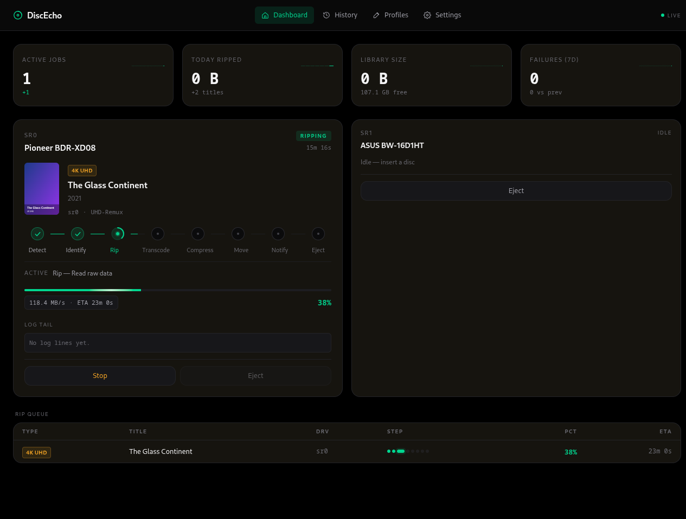
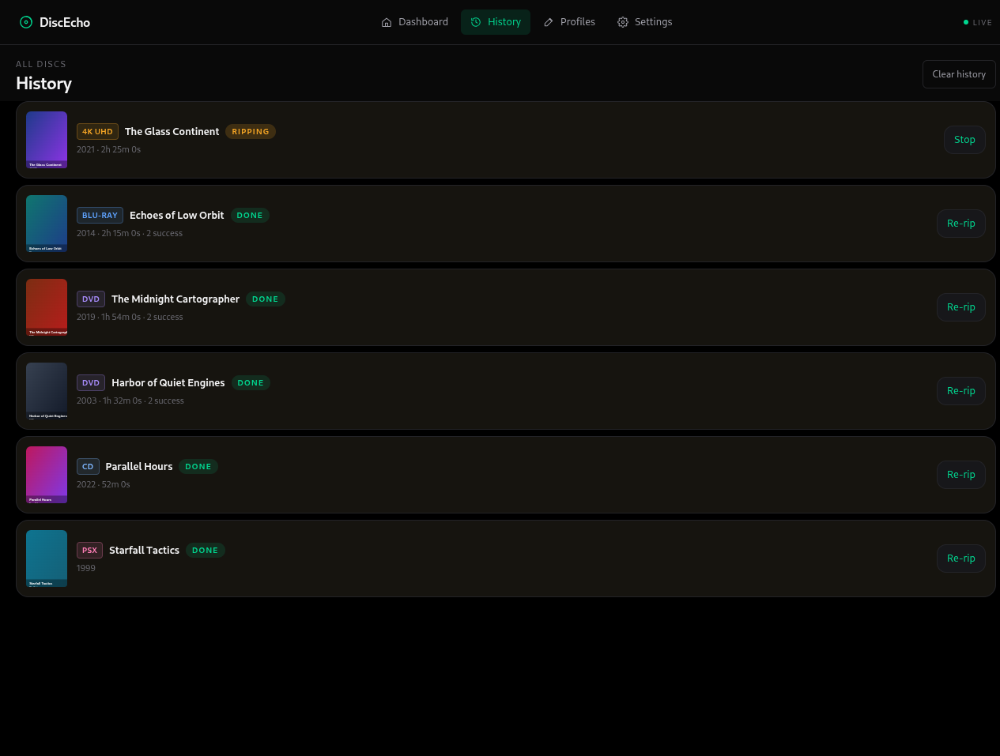
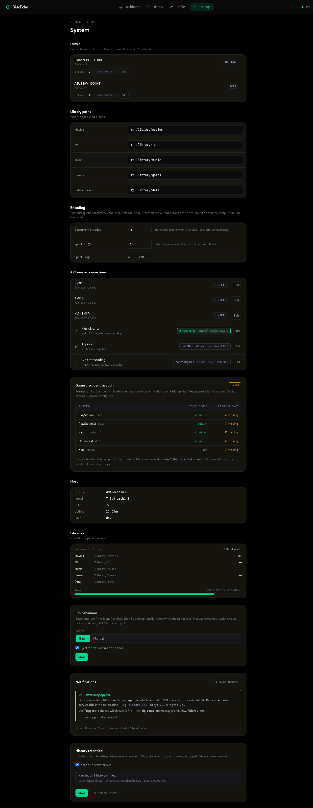
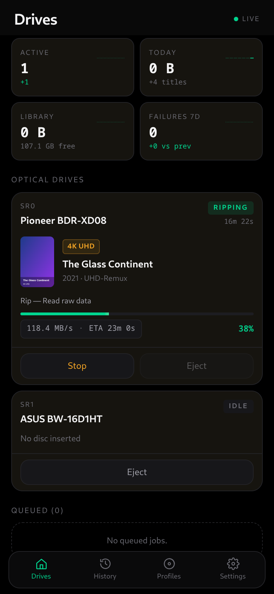
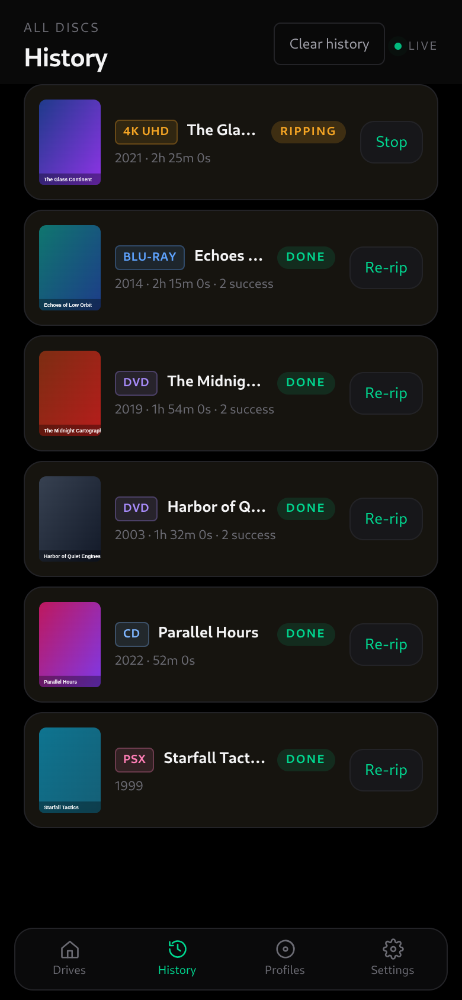
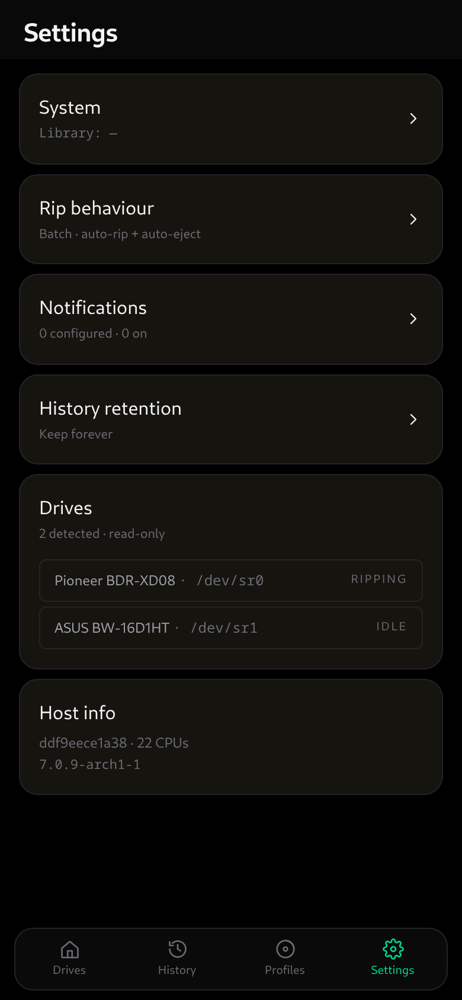

# DiscEcho

Self-hosted optical-disc archival service for the homelab. Watches
optical drives, classifies inserted discs, runs per-disc-type rip →
transcode → tag → move pipelines, and exposes a mobile-first web UI for
live status and history.

Rip, transcode, tag and file your physical media automatically — just feed
discs to the drive.

Supported disc types:

- **DVD / Blu-ray / 4K UHD** video (MakeMKV rip → optional HandBrake re-encode)
- **Audio CD** (whipper → FLAC, MusicBrainz-tagged, ReplayGain)
- **Game discs** — PlayStation, PlayStation 2, Saturn, Dreamcast, Xbox,
  Sega CD, 3DO, PC-FX, Atari Jaguar CD, Philips CD-i, PC Engine CD, Neo Geo CD
  (redumper + chdman, Redump-verified); Amiga CD32, FM Towns, and Bandai Pippin
  via manual disc-type override (not auto-detected)

## Screenshots

### Dashboard



### History



### Settings



### On mobile

The web UI is mobile-first:

| Dashboard | History | Settings |
|-----------|---------|----------|
|  |  |  |

<!-- Screenshots use fabricated, copyright-safe sample data; regenerate via docs/screenshots/. -->


## Quick start

```bash
git clone https://github.com/jumpingmushroom/DiscEcho.git
cd DiscEcho
cp .env.example .env
# edit DISCECHO_LIBRARY_PATH and CDROM_GID for your host
docker compose up -d --build
curl http://localhost:8088/api/health   # → {"ok":true}
```

Open `http://localhost:8088/` on your phone (or laptop in mobile
viewport) for the dashboard.

`DISCECHO_LIBRARY_PATH` (host bind mount) and `DISCECHO_LIBRARY` (the
in-container path the daemon writes to, normally `/library`) seed the
library setting on first boot. After that, the value is editable from
Settings → System → Library and the new value is used on the next
container restart.

## How it works

A single Go daemon (chi + `modernc.org/sqlite`) watches the optical drives
via udev. When a disc is inserted it classifies the disc, then runs the
pipeline for that disc type (`daemon/pipelines/<type>/`) through the canonical
steps — **rip → transcode → compress → move → notify** — writing the finished
files into the library bind-mount. The same container also serves the embedded
SvelteKit SPA, so there is no separate frontend service.

The wire format shared between daemon and UI is defined once in
`daemon/state/types.go` and mirrored by hand in `webui/src/lib/wire.ts` (the
Go side is authoritative; there is no `shared/` package).

### Deployment

DiscEcho assumes a trusted LAN by default — no authentication is
required. Anyone who can reach `:8088` can list drives, start rips,
and manage profiles. This matches the homelab single-user case the
project is designed around: the embedded UI works on first install
with zero config.

To expose DiscEcho beyond your LAN:

1. Put it behind a reverse proxy that terminates TLS and handles
   authentication (Caddy with basicauth, Tailscale Funnel,
   Cloudflare Access, etc.).
2. Set `DISCECHO_TOKEN=<long random string>` on the daemon (`.env`,
   systemd unit, or compose env block).
3. Configure the proxy to inject `Authorization: Bearer <token>` on
   every upstream request — or strip auth at the proxy and use the
   token as a defense-in-depth layer.

The embedded SvelteKit UI does not send an `Authorization` header,
so once you set `DISCECHO_TOKEN` the UI only works through a proxy
that injects the header for you.

### Profiles

A profile decides how discs of one type are ripped and where the output
lands. Each disc type has a curated set of compatible engines — the
editor only offers valid combinations, and choosing a disc type
pre-fills a working profile you can tweak:

- **AUDIO_CD** → `whipper`. Audio CDs are ripped to lossless **FLAC**;
  whipper has no lossy output, so MP3/Ogg are intentionally not offered.
- **DVD** → `MakeMKV+HandBrake` (re-encode), `MakeMKV` (lossless
  passthrough), or `HandBrake` (dvdbackup + encode).
- **BDMV / UHD** → `MakeMKV+HandBrake` or `MakeMKV`.
- **PSX / PS2 / Saturn / Dreamcast / Sega CD / 3DO / PC-FX / Jaguar CD /
  CD-i / PC Engine CD / Neo Geo CD / CD32 / FM Towns / Pippin** →
  `redumper+chdman` (CHD).
- **Xbox** → `redumper` (ISO). **DATA** → `ddrescue` (ISO).

**Quality** (encoding profiles only) is a tier — `Archival`, `High`,
`Balanced`, `Space-saver`, or `Custom`. A tier resolves to the right
constant-quality RF and encoder speed-preset for the chosen codec
(x265, x264, NVENC, AV1 each use different RF scales). `Custom` exposes
the raw RF and encoder-preset fields. Lossless/passthrough engines have
no quality knob.

**Output path** is a Go `text/template` rooted at the library path. The
editor shows the variables available for the disc type as clickable
chips plus a live preview. Common variables: `.Artist .Album .Year
.TrackNumber .Title .DiscNumber` (audio), `.Title .Year` and
`.Show .Season .EpisodeNumber .EpisodeTitle` (video), `.Title .Year
.Region` (games). `printf` and `if` work, e.g.
`{{.Show}}/Season {{printf "%02d" .Season}}/…`.

### TMDB

DVD identification queries TMDB (https://www.themoviedb.org/). To enable
auto-identification:

1. Create a free TMDB account → settings → API → request a v3 key
2. Set `DISCECHO_TMDB_KEY=<your-key>` in your `.env`
3. Optional: `DISCECHO_TMDB_LANG=en-US` (or any TMDB-supported locale)

If the key is unset, identification returns empty candidates and the UI
prompts for manual title entry — the daemon still starts and other
pipelines (audio CD) work normally.

### BDMV / UHD setup

DiscEcho's Blu-ray (BDMV) and Ultra HD Blu-ray pipelines decrypt and
demux discs with [MakeMKV](https://www.makemkv.com/). Audio CD and DVD
work without any of the setup below; the rest is opt-in.

**MakeMKV beta key (BDMV + UHD).** MakeMKV needs a registration key.
While the project is in beta the author posts a public key that
refreshes roughly monthly:

- Forum thread: <https://forum.makemkv.com/forum/viewtopic.php?t=1053>

Set the env var on the daemon:

```env
DISCECHO_MAKEMKV_BETA_KEY=T-<rest-of-key>
```

DiscEcho writes `${DISCECHO_DATA}/MakeMKV/settings.conf` on each start.
Refresh the env var (and restart the container) when the public key
rotates. Symptom of an expired key: BDMV/UHD jobs fail at the rip step
with "registration key expired" in the logs. If the env var is unset
the daemon still starts; only BDMV/UHD jobs will fail.

**AACS2 keys (UHD only).** UHD-Blu-ray discs are encrypted with AACS2.
MakeMKV needs a `KEYDB.cfg` to decrypt. **DiscEcho does not ship
`KEYDB.cfg` and does not link to sources for it.** Sourcing one is
your responsibility and may be restricted in your jurisdiction.

Drop your `KEYDB.cfg` at:

```
${DISCECHO_DATA}/MakeMKV/KEYDB.cfg
```

If a UHD disc is inserted and `KEYDB.cfg` is missing, the job fails
fast at the identify step with a clear error before any disc read.
Regular BDMV (Blu-ray) discs do not need this file.

### Game-disc setup (PSX / PS2 / Saturn / Dreamcast / Xbox / Sega CD / 3DO / PC-FX / Jaguar CD / CD-i / PC Engine CD / Neo Geo CD / Amiga CD32 / FM Towns / Bandai Pippin)

DiscEcho's game-disc pipelines use
[redumper](https://github.com/superg/redumper) for ripping and
[chdman](https://github.com/mamedev/mame) (from MAME tools) for CHD
compression where applicable.

#### Automatic identification via embedded boot-code maps

Insert a recognised game disc and the dashboard shows the correct
title immediately — no extra setup required. DiscEcho reads the
on-disc identifier (SYSTEM.CNF boot code for PSX/PS2, IP.BIN product
number for Saturn and Dreamcast, XBE title ID for Xbox) and looks it
up against embedded community databases:

- **PS2** — [PCSX2 GameDB](https://github.com/PCSX2/pcsx2/blob/master/bin/resources/GameIndex.yaml) (~12K entries)
- **PSX** — [DuckStation gamedb](https://github.com/stenzek/duckstation) (~10K entries, includes cover URLs)
- **Saturn / Dreamcast** — [Libretro Redump metadata](https://github.com/libretro/libretro-database)

These databases ship inside the daemon binary (~2 MB total, ~27K
entries across four systems). No setup required for auto-identification.

Xbox boot-code auto-id is not currently supported (Libretro's Xbox
dat uses publisher codes rather than XBE title IDs); Xbox discs fall
back to Redump MD5 verify when a dat is present, or IGDB manual search.

**Sega CD, 3DO, PC-FX, Atari Jaguar CD, and Philips CD-i** are also
auto-detected by on-disc magic signatures (no embedded title database;
identification is post-rip via Redump dat or IGDB). **PC Engine CD and
Neo Geo CD** are not yet auto-detected — insert one of those and select
the disc type manually from the dashboard override before ripping.

**Amiga CD32, FM Towns, and Bandai Pippin** are not auto-detected; insert
one of these, select the disc type manually from the override, then start
the rip. Post-rip Redump dat verification is available for all three if the
matching dat-file is present.

Disc detection is automatic:

- PSX/PS2: classifier reads `/SYSTEM.CNF` and parses the `BOOT[2]=`
  line (case-insensitive) to distinguish them.
- Saturn: raw sector 0 magic `SEGA SEGASATURN` + product number
  from IP.BIN.
- Dreamcast: multi-session TOC heuristic (two sessions with session
  2 starting at LBA ≥ 45000); product number read from IP.BIN at
  sector 45000.
- Xbox: `/default.xbe` at the disc root + XBE certificate title ID.
  Original Xbox only — Xbox 360 (XGD2/3) requires Kreon-flashed
  drive firmware and is out of scope.
- Sega CD: raw sector 0 magic `SEGADISCSYSTEM` or `SEGABOOTDISC`
  (cooked or raw 2352-byte sector layout).
- 3DO: sector 0 binary volume magic.
- PC-FX: sector 0 substring `PC-FX:Hu_CD-ROM`.
- Atari Jaguar CD: sector 0 substring `ATARI APPROVED DATA HEADER ATRI`.
  Note: the Jaguar CD boot header lives in the disc's second session, so
  physical discs may not auto-detect — use the manual override if needed.
- Philips CD-i: ISO 9660 PVD standard-identifier `CD-I ` or system-identifier
  containing `CD-RTOS`.

#### Optional: Redump dat-files for byte-perfect verification

If you drop Redump `.dat` files into `${DISCECHO_DATA}/redump/<system>/`,
the daemon will MD5-verify your rip against the Redump reference at the
compress step. This is an integrity check on top of the boot-code
auto-id — ripping and identification work without it.

```
${DISCECHO_DATA}/redump/psx/Sony - PlayStation - Datfile (*.dat)
${DISCECHO_DATA}/redump/ps2/Sony - PlayStation 2 - Datfile (*.dat)
${DISCECHO_DATA}/redump/saturn/Sega - Saturn - Datfile (*.dat)
${DISCECHO_DATA}/redump/dc/Sega - Dreamcast - Datfile (*.dat)
${DISCECHO_DATA}/redump/xbox/Microsoft - Xbox - Datfile (*.dat)
${DISCECHO_DATA}/redump/sega-cd/Sega - Mega-CD & Sega CD - Datfile (*.dat)
${DISCECHO_DATA}/redump/3do/Panasonic - 3DO Interactive Multiplayer - Datfile (*.dat)
${DISCECHO_DATA}/redump/pc-fx/NEC - PC-FX & PC-FXGA - Datfile (*.dat)
${DISCECHO_DATA}/redump/jaguar-cd/Atari - Jaguar CD Interactive Multimedia System - Datfile (*.dat)
${DISCECHO_DATA}/redump/cdi/Philips - CD-i - Datfile (*.dat)
${DISCECHO_DATA}/redump/pc-engine-cd/NEC - PC Engine CD & TurboGrafx-CD - Datfile (*.dat)
${DISCECHO_DATA}/redump/neo-geo-cd/SNK - Neo Geo CD - Datfile (*.dat)
${DISCECHO_DATA}/redump/cd32/Commodore - Amiga CD32 - Datfile (*.dat)
${DISCECHO_DATA}/redump/fm-towns/Fujitsu - FM Towns series - Datfile (*.dat)
${DISCECHO_DATA}/redump/pippin/Apple - Pippin - Datfile (*.dat)
```

Sourced from <http://redump.org/downloads/>. Refresh manually as
Redump adds new dumps. **DiscEcho does not auto-download or
redistribute these files.**

The daemon walks `${DISCECHO_DATA}/redump/<system>/*.dat` at startup
and merges every dat-file into one in-memory index. Dat files placed
directly under `${DISCECHO_DATA}/redump/` (without a subdirectory)
are not loaded; move them into the right per-system subfolder.

**Settings → API keys & connections → Game disc identification** shows a
per-system table of which boot-code maps and Redump dats are present vs
missing, plus the dats directory. Because dats load at startup, a file
added while the daemon is running shows as present but needs a restart to
take effect.

#### Optional: IGDB for manual search of unidentified discs

If a disc is not in any embedded database (later releases, regional
variants, homebrew), the awaiting-decision card offers a "Search IGDB"
button. To enable it:

1. Register a free app at <https://dev.twitch.tv/console/apps> —
   choose category "Game Database".
2. Set the env vars in your `.env` or compose file:

   ```env
   DISCECHO_IGDB_CLIENT_ID=your-client-id
   DISCECHO_IGDB_CLIENT_SECRET=your-client-secret
   ```

3. Restart the container. The Settings → System tab will confirm IGDB
   is connected and show per-system boot-code map counts.

If the env vars are unset, the "Search manually" button surfaces a
clean "IGDB not configured" message — the daemon still starts and all
other pipelines work normally.

### Raw-data discs

Anything the classifier doesn't recognise (data CDs, data DVDs,
unrecognised game discs) routes to the `Data` pipeline: a straight
`dd` rip to ISO with `conv=noerror,sync` (bad sectors are zero-filled
rather than aborting). The disc filesystem's volume label becomes
the title; falls back to `data-disc-YYYYMMDD-HHMMSS` when no label
is present. SHA-256 of the produced ISO and total byte count are
stored on the disc record for verification later.

### Enabling GPU transcoding (NVIDIA NVENC)

DiscEcho can use NVIDIA NVENC for HandBrake-based transcodes (DVD and
Blu-ray pipelines). Encodes run 5–10× faster than software x264/x265
at a small visual-quality cost — acceptable for media-server use.

**Requirements**

- An NVIDIA GPU with NVENC support (any modern card; Quadro P-series,
  GeForce GTX 1050+, RTX, etc).
- NVIDIA driver installed on the host.
- [NVIDIA Container Toolkit](https://docs.nvidia.com/datacenter/cloud-native/container-toolkit/install-guide.html)
  configured on the Docker daemon so `runtime: nvidia` is recognised.

**Compose**

DiscEcho's bundled `docker-compose.yml` stays CPU-only by default —
adding `runtime: nvidia` there would break the container on hosts
without an NVIDIA GPU. Layer a per-host override:

```yaml
# docker-compose.override.yml
services:
  discecho:
    runtime: nvidia
    environment:
      NVIDIA_VISIBLE_DEVICES: all
      NVIDIA_DRIVER_CAPABILITIES: 'compute,video,utility'
```

`docker compose up -d` reads `docker-compose.yml` and any
`docker-compose.override.yml` automatically.

**Unraid**

Edit the DiscEcho container in the Unraid GUI:

- Extra parameters: `--runtime=nvidia`
- Variable: `NVIDIA_VISIBLE_DEVICES` = `all`
- Variable: `NVIDIA_DRIVER_CAPABILITIES` = `compute,video,utility`

**Configuring profiles**

In the webui → Profiles, edit a HandBrake or MakeMKV+HandBrake
profile and set `video_codec` to `nvenc_h264` or `nvenc_h265`. The
daemon detects NVENC availability at boot — visible in **Settings →
Integrations → GPU transcoding**. When `connected`, profiles
requesting NVENC use the hardware encoder. When `not configured`,
NVENC profiles silently fall back to the matching software encoder
(`x264` / `x265` / `x265_10bit` for BDMV) with a `WARN` line in the
job log.

### History retention

**Settings → History retention** controls how long completed-rip history
records are kept (it never touches your ripped files). By default everything
is kept forever. Turn that off to set independent limits for **successful**
rips and **failed / cancelled** rips — each with an optional max age in days
and/or an optional cap on how many of the newest entries to keep (set either,
both, or neither per outcome). With "keep forever" off and no further changes,
the defaults keep successful rips and prune failures after 14 days.

A background sweep runs daily at 03:00 (daemon-local) and on startup; the page
shows a live preview of what the current policy would remove, the last/next run
times, and a **Run cleanup now** button that applies the saved policy
immediately.

### Notifications

DiscEcho sends notifications through [Apprise](https://github.com/caronc/apprise),
which fans 100+ services out from a single URL. Add a notification under
**Settings → Notifications** and paste an Apprise service URL (e.g.
`discord://…`, `ntfy://…`, `tgram://…` — see the
[supported services](https://appriseit.com/services/)). Per-notification
**Triggers** select which events fire:

- `done` — a rich, media-aware "ripped" message (movie / TV / audio / game /
  data) with duration, size, counts, codec, and cover/poster art when available.
- `failed` — a failure alert with the failed step and error.

Apprise failures never fail a rip — the bits are already in the library.

## Dev setup

You need:

- Go 1.24+
- Node 20 LTS, pnpm 9
- Docker with BuildKit
- Linux host with at least one optical drive at `/dev/sr0` (manual
  testing of disc detection is Linux-only; macOS / Windows can build and
  unit-test)

Local loop:

```bash
# 1. Build the UI (run once, then re-run after UI changes)
cd webui && pnpm install && pnpm build && cd ..
rm -rf daemon/embed/webui_build && cp -r webui/build daemon/embed/webui_build

# 2. Run the daemon
cd daemon && go run ./cmd/discecho

# 3. (separate shell) UI dev server with hot reload, proxies /api → :8088
cd webui && pnpm dev    # opens http://localhost:5173
```

Tests:

```bash
cd daemon && go test ./... -race
cd webui  && pnpm check
```

## Layout

| Path                  | Purpose                                             |
|-----------------------|-----------------------------------------------------|
| `daemon/`             | Go service: HTTP API, udev, disc pipelines          |
| `webui/`              | SvelteKit dark-only PWA + desktop dashboard         |
| `Dockerfile`          | Multi-stage build → `python:3.12-slim` runtime      |
| `docker-compose.yml`  | Single-service homelab deploy                       |

## Contributing

See [`CONTRIBUTING.md`](./CONTRIBUTING.md).

## License

Released under the [MIT License](./LICENSE).
